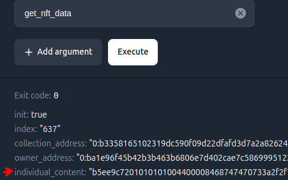

To convert the hex code that you can get from a ton explorer like: [tonviewr](https://tonviewer.com/) when visiting an NFT page on methods tab click on `get_nft_data` methode and execute.




## Prasing off-chain metadata using Typescript

```ts
import { Cell } from "@ton/ton";

async function parseBocAndExtractContent(bocString: string) {
  try {
    // Convert the hex string to a Buffer
    const buffer = Buffer.from(bocString, 'hex');

    // Create a Cell from the Buffer
    const bocCell = Cell.fromBoc(buffer)[0];

    // Begin parsing the cell
    const slice = bocCell.beginParse();

    // Load the content as a string
    const content = slice.loadStringTail();

    return content;
  } catch (error) {
    console.error("Error parsing BOC:", error);
    return null;
  }
}

// Example usage:
const bocString = "b5ee9c7201010101004400008468747470733a2f2f73746f726167652e6f6e746f6e2e6c6976652f6f6e746f6e2f576d6d65595f313732363331383738393533395f6d657461646174612e6a736f6e";

parseBocAndExtractContent(bocString)
  .then(content => {
    console.log("Extracted content:", content);
  })
  .catch(error => {
    console.error("Error:", error);
  });
```
