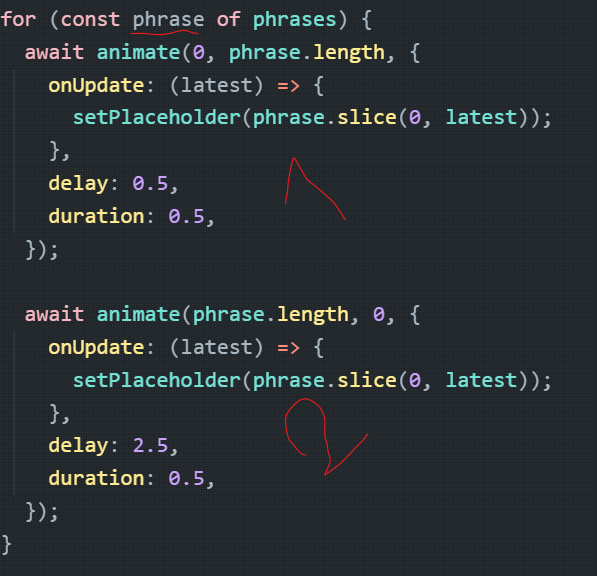

Creating a cool placeholder text writing effect animation in [React](https://react.dev/) using [Framer-Motion](https://framer.com/motion) was one the recent challenges that I overcome and today I want to share it with you guys.

## Framer Motion Solution

This solution is pretty easy to understand and implement in framer motion.
This animation is achievable via `animate` function provided by Framer Motion, you can learn about how it works [here](https://www.framer.com/motion/animate-function/).

```tsx
import { animate } from "framer-motion";
import { useEffect, useRef, useState } from "react";

const phrases = [
	"Enter a phrase to learn it!",
	"こんにちは、リンゴザンです。",
	"Silav navê min Lingozan e.",
	"Hallo, mein Name ist Lingozan.",
];

export function PlaceHolderAnimation() {
	const [placeholder, setPlaceholder] = useState("");
	const inputRef = useRef<HTMLTextAreaElement>(null);

	useEffect(() => {
		async function runAnimations() {
			while (true) {
				for (const phrase of phrases) {
					await animate(0, phrase.length, {
						onUpdate: (latest) => {
							setPlaceholder(phrase.slice(0, latest));
						},
						delay: 0.5,
						duration: 0.5,
					});

					await animate(phrase.length, 0, {
						onUpdate: (latest) => {
							setPlaceholder(phrase.slice(0, latest));
						},
						delay: 2.5,
						duration: 0.5,
					});
				}
			}
		}

		runAnimations();
	}, []);

	return <textarea ref={inputRef} placeholder={placeholder} />;
}
```

In this example as you can see I have several phrases that i want them to be animated in a sequential order.

## How it works?

I think it’s obvious enough that we iterate through the phrases and for each one we have a two step animation.



The first one is for **writing animation** and second one for **erasing animation**. at the **start of the animation** the placeholder state is empty and the we ask the `animate` function to start animating number `0` to `phrase.length` in the duration of `0.5`seconds.

When the value increases from `0` we want to slowly set the placeholder value to the phrase from index `0` to how far we animated.

The erasing animation is the same but reverse, it’s from the `phrase.length` to `0`.
