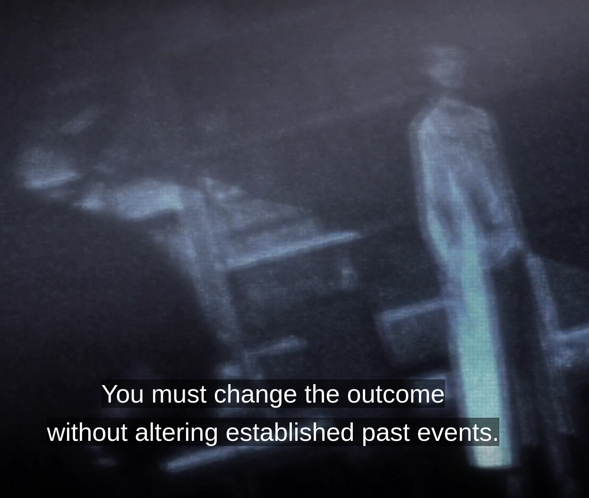

They literally have auto-error correction in their world. Just think about it, [Okabe](https://en.wikipedia.org/wiki/Rintaro_Okabe) disappears in one of the episodes, and everyone forgets about him. It’s almost like the world automatically corrects errors that shouldn’t be there, ensuring that nothing is out of order.

## Hamming Code

I was watching [this video](https://www.youtube.com/watch?v=X8jsijhllIA&t=897s) for the first time about error-correcting algorithms. In this video, [Hamming Code](https://en.wikipedia.org/wiki/Hamming_code) is discussed. Here’s a brief description of what Hamming code is, in my opinion:

> Hamming Code is a method for automatically correcting errors in digital communications and data storage. By errors, we mean incorrect bits. Everything is made of 1s and 0s, and sometimes these 1s and 0s aren’t what we intended. We call these incorrect bits “errors,” which Hamming helps us find and fix.

## Steins;Gate

If you’re unfamiliar with [Steins;Gate](/posts/steins-gate), I’ve already written about it here. The entire series revolves around fighting against this auto-error correction algorithm. The series begins with Okabe’s friend dying, and since he’s been meddling with time-travel, he actually goes back in time to save her. He tries to alter the “bits” of his world by preventing what caused her to die, but no matter what... the result is always the same: either she or the girl he loves ends up dying, over and over again.

But no error correction is 100% accurate. Sometimes, even the algorithm can’t detect the errors. This is where the concept of Steins;Gate comes into play. Steins;Gate represents an outcome where both his childhood friend and his lover survive. It’s about altering the bits in such a way that both of them live, while the error correction algorithm fails to detect the anomalies in the system.

### Okabe Disappearing

When Okabe receives a message from his future self, he will be given a mission to change the past in a way that all the effects of those events still remain. He alters the past thus the outcome in such a way that he finally saves both of his friends but he himself stops existing and disappears. Everyone forgets about him as a result (or the simulation makes them forget). This is the simulation correcting itself, because his memories of other worldlines contradict the Steins;Gate outcome, so the worldline fixes itself by removing the "wrong bits" which in this case is Okarin.

#### Are we part of a simulation?

Im sure there is much more terrefing stuff deep in science that we could say "we can make the same conclusion" as we did here wrong or right. Or have the same reasoning as I did here. When I study Astrophysics sometimes I feel like the univese is just a game, there are so many intresting things going on out there.

## Conclusion (tutturu)

The rest depends on your imagination and curiosity to connect the dots, or to disagree with me.
